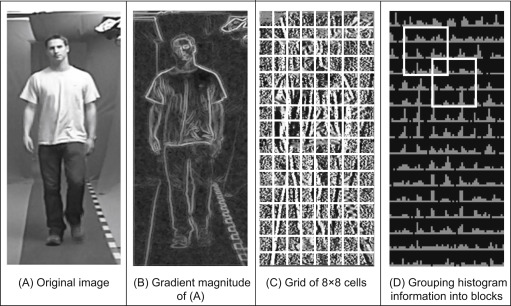
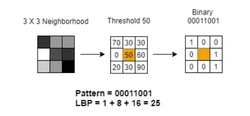

# HOG-LBP-Hybrid-Feature-Extraction-for-Texture
Hybrid Histogram Oriented Gradient and Local Binary Pattern for Image Feature Extraction

# Histogram oriented Gradient

  

Histogram of Oriented Gradients (HOG) is a feature descriptor used in computer vision and image processing for object detection. It focuses on the structure or shape within an image by capturing the distribution of gradients, or edge directions, in localized portions of the image.

Here’s how HOG works:

1. **Gradient Calculation**: The first step involves computing the gradient of the image. This is typically done by applying a filter (like the Sobel operator) to the image, which results in gradient values for each pixel. These gradients represent the direction and magnitude of the edges in the image.

2. **Orientation Binning**: The image is divided into small, connected regions called cells. For each cell, a histogram of gradient directions is created. The gradient magnitudes are used as the weights for the histogram, which means stronger edges have a greater influence on the histogram. The orientations are usually quantized into bins (e.g., 9 bins for 0-180 degrees).

3. **Block Normalization**: To achieve invariance to changes in lighting and contrast, the histograms from adjacent cells are grouped into larger regions called blocks. The histograms within each block are then normalized. This step helps in reducing the impact of variations in illumination and shadows.

4. **Feature Vector Formation**: The normalized histograms from all the blocks are concatenated to form a single feature vector, which represents the entire image or a region of the image. This feature vector is then used for tasks like classification or detection.

HOG is particularly effective for detecting objects with defined edges and shapes, such as humans in images. It's widely used in applications like pedestrian detection, where the consistent shapes of objects across images make HOG a robust and reliable feature descriptor.

# Local Binary Pattern

  

Local Binary Patterns (LBP) is a feature extraction method used in computer vision for texture classification. The technique involves comparing each pixel in a grayscale image with its surrounding neighbors to create a binary pattern. This pattern encodes the local texture information around the pixel and is represented as a binary number, which is then converted into a decimal value. 

The key idea behind LBP is to capture the spatial structure of local image textures by comparing pixel intensities in a circular neighborhood. The process can be summarized in three steps:

1. **Thresholding**: For each pixel in the image, compare its intensity value with the intensity values of its neighboring pixels. If the neighbor's intensity is greater than or equal to the central pixel, assign a value of 1; otherwise, assign a value of 0.
  
2. **Binary Pattern Formation**: Arrange the resulting binary values into a sequence, usually in a clockwise direction starting from the top-left neighbor. This sequence forms the LBP code.

3. **Histogram Representation**: The image is divided into regions, and for each region, the LBP codes are computed and collected into a histogram. This histogram represents the texture of that region.

LBP is powerful because it is invariant to monotonic changes in lighting and is computationally efficient. It's widely used in applications like face recognition, texture classification, and object detection due to its simplicity and effectiveness in capturing fine details of textures.

# Hybrid HoG-LBP
A Hybrid HOG-LBP (Histogram of Oriented Gradients - Local Binary Patterns) is a feature extraction method that combines the strengths of both HOG and LBP techniques to enhance the representation of texture and shape information in an image. This hybrid approach is especially useful in scenarios where capturing both edge orientation and local texture is crucial for accurate image analysis, such as in face recognition or object detection.

### Key Concepts of Hybrid HOG-LBP:

1. **Gradient and Texture Representation**:
   - **HOG** captures the overall shape and structure of objects by focusing on edge orientations and their distributions. It's particularly effective for detecting and recognizing objects with consistent and prominent edges.
   - **LBP** captures local texture patterns by encoding the relationship between a pixel and its neighboring pixels. It is robust to variations in lighting and captures fine details in textures.

2. **Feature Extraction Process**:
   - First, the image is divided into small cells, similar to the process in HOG.
   - For each cell, the HOG descriptor is calculated by obtaining the gradients, creating histograms of oriented gradients, and then normalizing these histograms within blocks.
   - Simultaneously, the LBP descriptor is computed for the same cells by comparing each pixel with its neighbors to form binary patterns, which are then converted into histograms representing local textures.
   - The HOG and LBP features are either concatenated directly or combined through another method (e.g., weighted sum) to form a hybrid feature vector.

3. **Advantages**:
   - **Complementary Strengths**: HOG captures global shape information, while LBP focuses on local textures, making the hybrid method capable of providing a richer and more detailed representation of the image.
   - **Robustness**: The combination offers robustness to both variations in lighting (handled by LBP) and changes in object orientation or pose (handled by HOG).
   - **Improved Accuracy**: The hybrid approach often leads to improved performance in classification or detection tasks compared to using HOG or LBP alone.

4. **Applications**:
   - **Face Recognition**: In facial analysis, the texture (wrinkles, skin patterns) and the shape (facial contours) are both important, making HOG-LBP a strong choice.
   - **Object Detection**: The hybrid method enhances detection accuracy in scenarios where objects have both distinctive shapes and textures.
   - **Medical Image Analysis**: For analyzing medical images, where both the structure and the texture of tissues are important, HOG-LBP can be highly effective.

In summary, the Hybrid HOG-LBP approach leverages the strengths of both HOG and LBP to provide a more comprehensive feature representation, improving the performance of image analysis tasks in various applications.